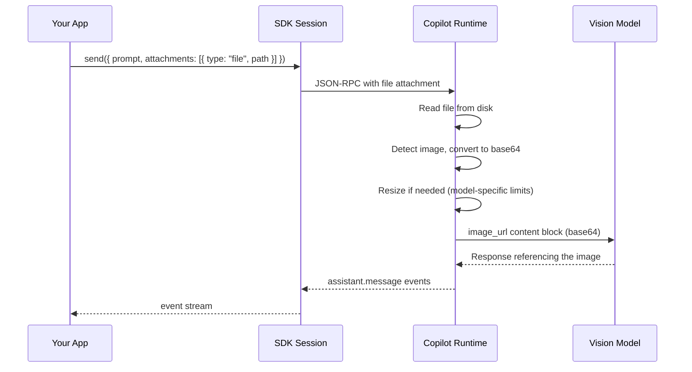

# Image Input

Send images to Copilot sessions as attachments. There are two ways to attach images:

- **File attachment** (`type: "file"`) — provide an absolute path; the runtime reads the file from disk, converts it to base64, and sends it to the LLM.
- **Blob attachment** (`type: "blob"`) — provide base64-encoded data directly; useful when the image is already in memory (e.g., screenshots, generated images, or data from an API).

## Overview



| Concept | Description |
|---------|-------------|
| **File attachment** | An attachment with `type: "file"` and an absolute `path` to an image on disk |
| **Blob attachment** | An attachment with `type: "blob"`, base64-encoded `data`, and a `mimeType` — no disk I/O needed |
| **Automatic encoding** | For file attachments, the runtime reads the image and converts it to base64 automatically |
| **Auto-resize** | The runtime automatically resizes or quality-reduces images that exceed model-specific limits |
| **Vision capability** | The model must have `capabilities.supports.vision = true` to process images |

## Quick Start — File Attachment

Attach an image file to any message using the file attachment type. The path must be an absolute path to an image on disk.

<details open>
<summary><strong>Node.js / TypeScript</strong></summary>

```typescript
import { CopilotClient } from "@github/copilot-sdk";

const client = new CopilotClient();
await client.start();

const session = await client.createSession({
    model: "gpt-4.1",
    onPermissionRequest: async () => ({ kind: "approved" }),
});

await session.send({
    prompt: "Describe what you see in this image",
    attachments: [
        {
            type: "file",
            path: "/absolute/path/to/screenshot.png",
        },
    ],
});
```

</details>

<details>
<summary><strong>Python</strong></summary>

```python
from copilot import CopilotClient
from copilot.types import PermissionRequestResult

client = CopilotClient()
await client.start()

session = await client.create_session(
    on_permission_request=lambda req, inv: PermissionRequestResult(kind="approved"),
    model="gpt-4.1",
)

await session.send(
    "Describe what you see in this image",
    attachments=[
        {
            "type": "file",
            "path": "/absolute/path/to/screenshot.png",
        },
    ],
)
```

</details>

<details>
<summary><strong>Go</strong></summary>

<!-- docs-validate: hidden -->
```go
package main

import (
	"context"
	copilot "github.com/github/copilot-sdk/go"
)

func main() {
	ctx := context.Background()
	client := copilot.NewClient(nil)
	client.Start(ctx)

	session, _ := client.CreateSession(ctx, &copilot.SessionConfig{
		Model: "gpt-4.1",
		OnPermissionRequest: func(req copilot.PermissionRequest, inv copilot.PermissionInvocation) (copilot.PermissionRequestResult, error) {
			return copilot.PermissionRequestResult{Kind: copilot.PermissionRequestResultKindApproved}, nil
		},
	})

	path := "/absolute/path/to/screenshot.png"
	session.Send(ctx, copilot.MessageOptions{
		Prompt: "Describe what you see in this image",
		Attachments: []copilot.Attachment{
			{
				Type: copilot.AttachmentTypeFile,
				Path: &path,
			},
		},
	})
}
```
<!-- /docs-validate: hidden -->

```go
ctx := context.Background()
client := copilot.NewClient(nil)
client.Start(ctx)

session, _ := client.CreateSession(ctx, &copilot.SessionConfig{
    Model: "gpt-4.1",
    OnPermissionRequest: func(req copilot.PermissionRequest, inv copilot.PermissionInvocation) (copilot.PermissionRequestResult, error) {
        return copilot.PermissionRequestResult{Kind: copilot.PermissionRequestResultKindApproved}, nil
    },
})

path := "/absolute/path/to/screenshot.png"
session.Send(ctx, copilot.MessageOptions{
    Prompt: "Describe what you see in this image",
    Attachments: []copilot.Attachment{
        {
            Type: copilot.AttachmentTypeFile,
            Path: &path,
        },
    },
})
```

</details>

<details>
<summary><strong>.NET</strong></summary>

<!-- docs-validate: hidden -->
```csharp
using GitHub.Copilot.SDK;

public static class ImageInputExample
{
    public static async Task Main()
    {
        await using var client = new CopilotClient();
        await using var session = await client.CreateSessionAsync(new SessionConfig
        {
            Model = "gpt-4.1",
            OnPermissionRequest = (req, inv) =>
                Task.FromResult(new PermissionRequestResult { Kind = PermissionRequestResultKind.Approved }),
        });

        await session.SendAsync(new MessageOptions
        {
            Prompt = "Describe what you see in this image",
            Attachments = new List<UserMessageDataAttachmentsItem>
            {
                new UserMessageDataAttachmentsItemFile
                {
                    Path = "/absolute/path/to/screenshot.png",
                    DisplayName = "screenshot.png",
                },
            },
        });
    }
}
```
<!-- /docs-validate: hidden -->

```csharp
using GitHub.Copilot.SDK;

await using var client = new CopilotClient();
await using var session = await client.CreateSessionAsync(new SessionConfig
{
    Model = "gpt-4.1",
    OnPermissionRequest = (req, inv) =>
        Task.FromResult(new PermissionRequestResult { Kind = PermissionRequestResultKind.Approved }),
});

await session.SendAsync(new MessageOptions
{
    Prompt = "Describe what you see in this image",
    Attachments = new List<UserMessageDataAttachmentsItem>
    {
        new UserMessageDataAttachmentsItemFile
        {
            Path = "/absolute/path/to/screenshot.png",
            DisplayName = "screenshot.png",
        },
    },
});
```

</details>

## Quick Start — Blob Attachment

When you already have image data in memory (e.g., a screenshot captured by your app, or an image fetched from an API), use a blob attachment to send it directly without writing to disk.

<details open>
<summary><strong>Node.js / TypeScript</strong></summary>

```typescript
import { CopilotClient } from "@github/copilot-sdk";

const client = new CopilotClient();
await client.start();

const session = await client.createSession({
    model: "gpt-4.1",
    onPermissionRequest: async () => ({ kind: "approved" }),
});

const base64ImageData = "..."; // your base64-encoded image
await session.send({
    prompt: "Describe what you see in this image",
    attachments: [
        {
            type: "blob",
            data: base64ImageData,
            mimeType: "image/png",
            displayName: "screenshot.png",
        },
    ],
});
```

</details>

<details>
<summary><strong>Python</strong></summary>

```python
from copilot import CopilotClient
from copilot.types import PermissionRequestResult

client = CopilotClient()
await client.start()

session = await client.create_session({
    "model": "gpt-4.1",
    "on_permission_request": lambda req, inv: PermissionRequestResult(kind="approved"),
})

base64_image_data = "..."  # your base64-encoded image
await session.send(
    "Describe what you see in this image",
    attachments=[
        {
            "type": "blob",
            "data": base64_image_data,
            "mimeType": "image/png",
            "displayName": "screenshot.png",
        },
    ],
)
```

</details>

<details>
<summary><strong>Go</strong></summary>

<!-- docs-validate: hidden -->
```go
package main

import (
	"context"
	copilot "github.com/github/copilot-sdk/go"
)

func main() {
	ctx := context.Background()
	client := copilot.NewClient(nil)
	client.Start(ctx)

	session, _ := client.CreateSession(ctx, &copilot.SessionConfig{
		Model: "gpt-4.1",
		OnPermissionRequest: func(req copilot.PermissionRequest, inv copilot.PermissionInvocation) (copilot.PermissionRequestResult, error) {
			return copilot.PermissionRequestResult{Kind: copilot.PermissionRequestResultKindApproved}, nil
		},
	})

	base64ImageData := "..."
	mimeType := "image/png"
	displayName := "screenshot.png"
	session.Send(ctx, copilot.MessageOptions{
		Prompt: "Describe what you see in this image",
		Attachments: []copilot.Attachment{
			{
				Type:        copilot.AttachmentTypeBlob,
				Data:        &base64ImageData,
				MIMEType:    &mimeType,
				DisplayName: &displayName,
			},
		},
	})
}
```
<!-- /docs-validate: hidden -->

```go
mimeType := "image/png"
displayName := "screenshot.png"
session.Send(ctx, copilot.MessageOptions{
    Prompt: "Describe what you see in this image",
    Attachments: []copilot.Attachment{
        {
            Type:        copilot.AttachmentTypeBlob,
            Data:        &base64ImageData, // base64-encoded string
            MIMEType:    &mimeType,
            DisplayName: &displayName,
        },
    },
})
```

</details>

<details>
<summary><strong>.NET</strong></summary>

<!-- docs-validate: hidden -->
```csharp
using GitHub.Copilot.SDK;

public static class BlobAttachmentExample
{
    public static async Task Main()
    {
        await using var client = new CopilotClient();
        await using var session = await client.CreateSessionAsync(new SessionConfig
        {
            Model = "gpt-4.1",
            OnPermissionRequest = (req, inv) =>
                Task.FromResult(new PermissionRequestResult { Kind = PermissionRequestResultKind.Approved }),
        });

        var base64ImageData = "...";
        await session.SendAsync(new MessageOptions
        {
            Prompt = "Describe what you see in this image",
            Attachments = new List<UserMessageDataAttachmentsItem>
            {
                new UserMessageDataAttachmentsItemBlob
                {
                    Data = base64ImageData,
                    MimeType = "image/png",
                    DisplayName = "screenshot.png",
                },
            },
        });
    }
}
```
<!-- /docs-validate: hidden -->

```csharp
await session.SendAsync(new MessageOptions
{
    Prompt = "Describe what you see in this image",
    Attachments = new List<UserMessageDataAttachmentsItem>
    {
        new UserMessageDataAttachmentsItemBlob
        {
            Data = base64ImageData,
            MimeType = "image/png",
            DisplayName = "screenshot.png",
        },
    },
});
```

</details>

## Supported Formats

Supported image formats include JPG, PNG, GIF, and other common image types. For file attachments, the runtime reads the image from disk and converts it as needed. For blob attachments, you provide the base64 data and MIME type directly. Use PNG or JPEG for best results, as these are the most widely supported formats.

The model's `capabilities.limits.vision.supported_media_types` field lists the exact MIME types it accepts.

## Automatic Processing

The runtime automatically processes images to fit within the model's constraints. No manual resizing is required.

- Images that exceed the model's dimension or size limits are automatically resized (preserving aspect ratio) or quality-reduced.
- If an image cannot be brought within limits after processing, it is skipped and not sent to the LLM.
- The model's `capabilities.limits.vision.max_prompt_image_size` field indicates the maximum image size in bytes.

You can check these limits at runtime via the model capabilities object. For the best experience, use reasonably-sized PNG or JPEG images.

## Vision Model Capabilities

Not all models support vision. Check the model's capabilities before sending images.

### Capability fields

| Field | Type | Description |
|-------|------|-------------|
| `capabilities.supports.vision` | `boolean` | Whether the model can process image inputs |
| `capabilities.limits.vision.supported_media_types` | `string[]` | MIME types the model accepts (e.g., `["image/png", "image/jpeg"]`) |
| `capabilities.limits.vision.max_prompt_images` | `number` | Maximum number of images per prompt |
| `capabilities.limits.vision.max_prompt_image_size` | `number` | Maximum image size in bytes |

### Vision limits type

<!-- docs-validate: hidden -->
```typescript
interface VisionCapabilities {
    vision?: {
        supported_media_types: string[];
        max_prompt_images: number;
        max_prompt_image_size: number; // bytes
    };
}
```
<!-- /docs-validate: hidden -->
```typescript
vision?: {
    supported_media_types: string[];
    max_prompt_images: number;
    max_prompt_image_size: number; // bytes
};
```

## Receiving Image Results

When tools return images (e.g., screenshots or generated charts), the result contains `"image"` content blocks with base64-encoded data.

| Field | Type | Description |
|-------|------|-------------|
| `type` | `"image"` | Content block type discriminator |
| `data` | `string` | Base64-encoded image data |
| `mimeType` | `string` | MIME type (e.g., `"image/png"`) |

These image blocks appear in `tool.execution_complete` event results. See the [Streaming Events](./streaming-events.md) guide for the full event lifecycle.

## Tips & Limitations

| Tip | Details |
|-----|---------|
| **Use PNG or JPEG directly** | Avoids conversion overhead — these are sent to the LLM as-is |
| **Keep images reasonably sized** | Large images may be quality-reduced, which can lose important details |
| **Use absolute paths for file attachments** | The runtime reads files from disk; relative paths may not resolve correctly |
| **Use blob attachments for in-memory data** | When you already have base64 data (e.g., screenshots, API responses), blob avoids unnecessary disk I/O |
| **Check vision support first** | Sending images to a non-vision model wastes tokens without visual understanding |
| **Multiple images are supported** | Attach several attachments in one message, up to the model's `max_prompt_images` limit |
| **SVG is not supported** | SVG files are text-based and excluded from image processing |

## See Also

- [Streaming Events](./streaming-events.md) — event lifecycle including tool result content blocks
- [Steering & Queueing](./steering-and-queueing.md) — sending follow-up messages with attachments
